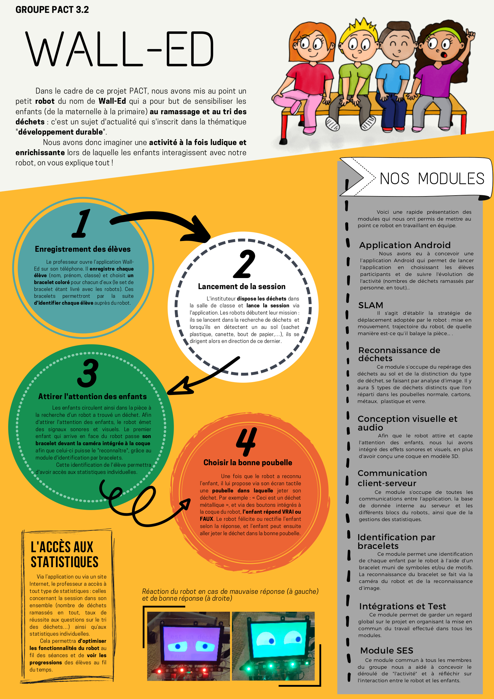

# Wall'ed
## Description
Wall'ed is an educative robot able to recognize wastes and interact with children, to teach them to pick up garbages (papers, plastics, etc).

It was realized as a seven-people group project during the first year at Télécom Paris.

## Organization
The directory `modules` contains the source code. See the `modules` section of this README.

The directory `rapport` contains an asciidoc report, I wouldn't advise trying to read it as it was mostly written at an early stage of the project, and has a weird structure (requested by our supervisors).

### Modules
The project was divided in height modules, one common to everyone, and all others only composed by two of us (and each of us had two of these modules).

#### Embedded systems
This module consisted in the creation of the robot and the handling of its moves.

#### Image recognition
This module dealt with the recognition of wastes, and the categorization.

#### Android application
This module was concerned with the creation of the Android application (obviously), which displayed statistics about the robot.

#### Visual and audio design
This module was about the looks of the robot and how it was supposed to interact with the children (sounds, appearance, buttons).

#### Client-server communication
This module handled the server, which connected the application to the robot itself.

#### Wristband identification
As we wanted to be able to identify the children (to know who participates and who gets it right or not), we though about using colored bracelets. This module created those wristband and recognized them.

#### Testing and integration
This module established the connexion between all other modules, ensuring that everything worked as it was supposed to and that everyone was doing what they had to. It also had the purpose of combining everything together.

#### Humanities
The whole group was part of this module, which consisted in thinking about how this robot was supposed to be used, how it would interact with the children, etc.

## Poster

## Disclaimer
The architecture of the project is a bit messy in my opinion, but it was asked by our supervisors.

Most of the project is in French.

It is tricky to use: you first need to launch the server and then the robot, and both necessitate lots of things to run.
