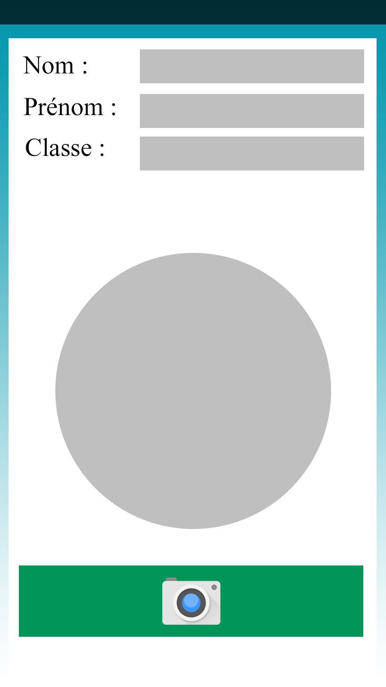
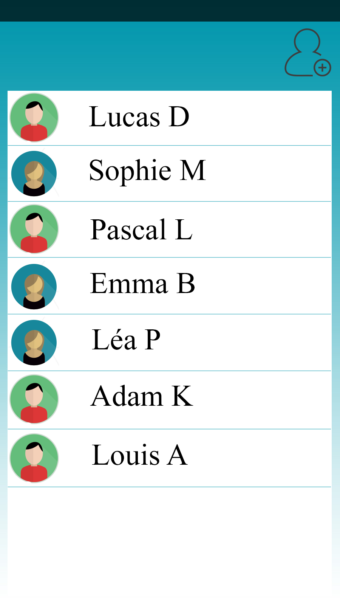
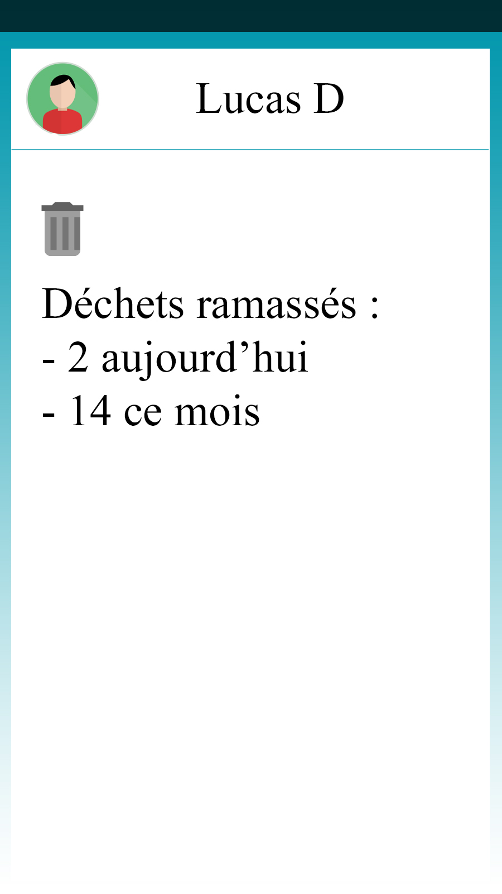

=== Interface utilisateur graphique

////
Il peut y avoir une ou plusieurs interfaces utilisateur (UI en anglais),
ou interface graphique, ou interface homme machine (IHM) : une interface
sur ordinateur et/ou une interface sur mobile ou tablette (Android),
selon le nombre d’appareils en jeu.

En lien avec un diagramme de séquence, une description simple de chaque
écran/page est nécessaire. Il est recommandé de faire des dessins, même
dessins au crayon photographiés ou scannés, car ce sont les meilleurs
supports de discussion : on appelle souvent ces dessins un
« storyboard ». Une description textuelle fait le lien entre tous les
éléments de l’IHM (ou des IHMs).
////

image::../images/Story_board_-_Menu_principal.jpg[Menu Principal,400]

Menu permettant de naviguer entre les options

Interface permettant d'ajouter un utilisateur

image::../images/Story_board_-_QR.jpg[QR menu,400]

Après l'ajout d'un utilisateur, interface pour scanner le QR code de son bracelet

Liste des utilisateurs enregistrés

Statistiques d'un utilisateur
