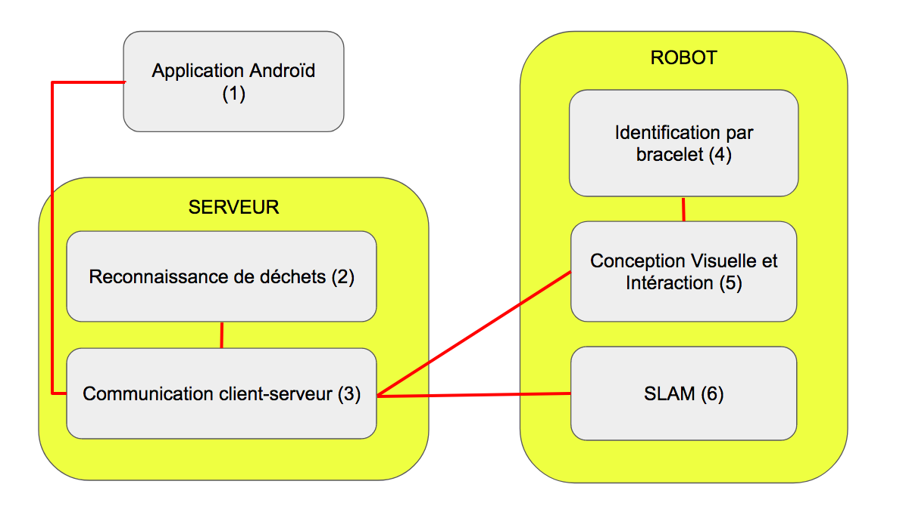

=== Schéma d’architecture

==== Description des blocs

===== BLOC APPLICATION ANDROÏD (1)

Application Android : ce module s'occupe de la conception de l'application Android permettant aux professeurs d'avoir accès aux statistiques individuelles (sur chaque élève) et globales liées à l'utilisation du robot.

===== BLOC RECONNAISSANCE DE DECHETS (2)

Ce module s'occupe du repérage des déchets au sol et de la distinction du type de déchet, se faisant par analyse d'image.

===== BLOC COMMUNICATION CLIENT-SERVEUR (3)

Ce module s'occupe de toutes les communications entre l'application, la base de donnée interne au serveur et les différents blocs du robots. On intègre également dans ce module la gestion des statistiques.

===== BLOC INDENTIFICATION PAR BRACELET (4)

Ce module permet une identification de chaque enfant par le robot à l'aide d'un bracelet muni de symboles et/ou de motifs. La reconnaissance du bracelet se fait via la caméra du robot et de la reconnaissance d'image.

===== BLOC CONCEPTION VISUELLE ET INTERACTION (5)

Ce module englobe l'allure générale du robot (impression 3D de la coque) et l'interaction avec l'élève (accessoires lumineux et sonores) afin qu'elle soit attractive pour l'enfant.

===== BLOC SLAM (6)

Ce module s'occupe de la stratégie de déplacement adoptée par le robot (mise en mouvement, trajectoire du robot, de quelle manière est-ce qu'il balaye la pièce), ainsi que du ramassage éventuel des déchets.
