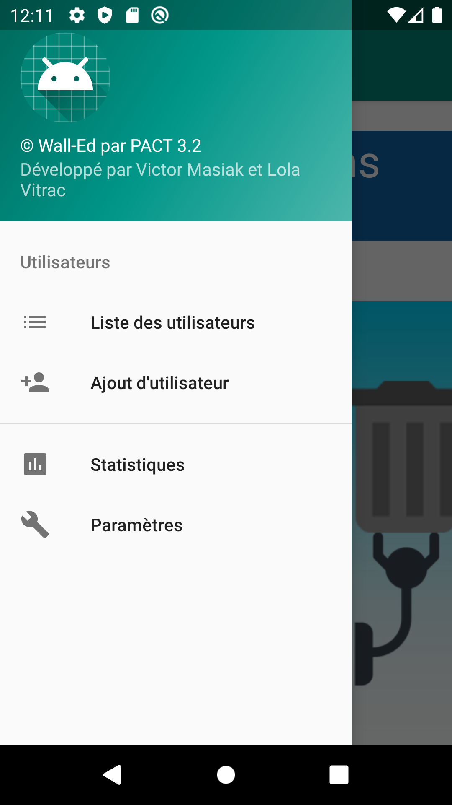
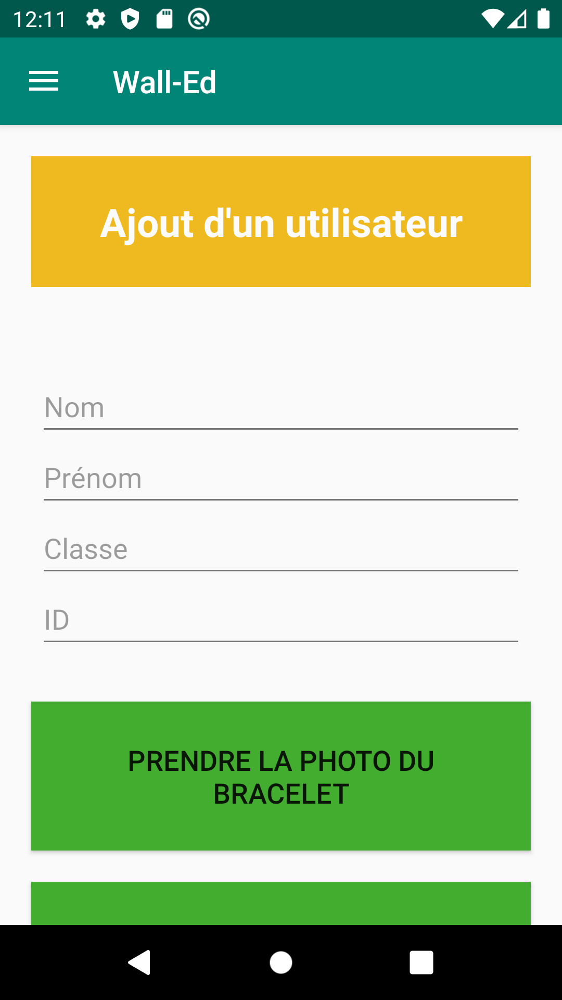
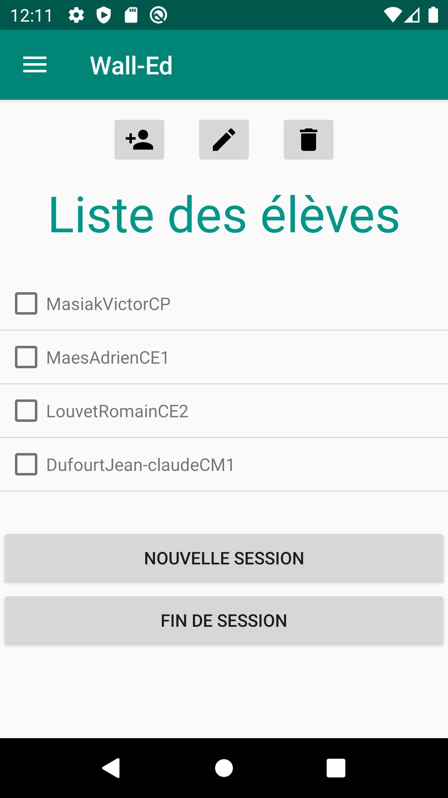

= Rapport d'avancement pour le PAN3

== ETAT ACTUEL DES MODULES

=== Module IDB (identification par bracelet) - Adrien Maes et Nicolas Jow

Nous avons codé en python la reconnaissance d'image. La fonction python est fonctionnelle. Le module est prêt à être intégré au code du robot.

=== Module COMCS (communication client-serveur) - Adrien Maes et Florian Le Mouël

Ce module se décompose en deux sous parties : une partie gestion interne du serveur et de la base de donnée utilisée, et une partie gérant les intéractions JAVA-JAVA et JAVA-PYTHON avec l'application Android et le robot.
Le minimum de fonctionnalités pour le projet est fonctionnel : création d'une session, ajout d'enfants, démarrage et arrêt d'une activité. Le lien entre le robot et le serveur qui analyse les images est lui aussi assuré.

*Partie BDD et serveur*

Le SGBD est installé (MariaDB dans un conteneur Docker) et fonctionnel, le code Java permettant l'édition d'une base de donnée est implémenté.
Pour l'instant, le code serveur tourne sur un ordinateur portable.
Le code Java permettant d'exécuter du code Python et de l'analyser est implémenté (pour faire tourner le module RECOD).

*Partie interface*

Les communications entre le serveur et l'application et entre le serveur et le robot sont parfaitement fonctionnelles, les échanges de données se font au format JSON et les images sont bien transmises entre le robot et le serveur.

=== Module reconnaissance d'images - Victor Masiak et Nicolas Jow

Après le PAN2, nous avons cherché à améliorer les performances du réseau, principalement en terme de vitesse. Nous nous sommes intéressés à divers implémentations de réseaux, que nous avons essayées. Nous nous sommes notamment attardés sur le projet https://github.com/jwyang/faster-rcnn.pytorch, mais n’arrivons pas à le faire fonctionner pour le moment, à cause de divers problèmes d’installations et de dépendances.

Nous continuons de chercher comment résoudre ces problèmes. En parallèle, nous nous intéressons à d’autres projets, notamment :

* https://github.com/pedropro/TACO
* https://github.com/matterport/Mask_RCNN

Nous rencontrons là encore des problèmes d’installations et de dépendances, que nous cherchons à résoudre.

Nous considérons également désormais le réseau conseillé par notre expert : Détectron 2 (https://colab.research.google.com/drive/16jcaJoc6bCFAQ96jDe2HwtXj7BMD_-m5#scrollTo=QHnVupBBn9eR) en espérant ne pas rencontrer les mêmes difficultés de version pour son installation.

Pour PAN3, nous avions donc prévu d’utiliser le réseau Inception V3, associé à une méthode de balayage. Celui-ci fonctionne très bien en terme d’efficacité des détections, mais est extrêmement lent (trop pour pouvoir traiter les images en temps réel). Aucune modification n’y a été apportée depuis le PAN2, sauf quelques modifications mineures pour l’intégration.

=== Module Android - Victor Masiak et Lola Vitrac

Le module Android était déjà bien avancé après le PAN 2, puisque nous disposions du squelette de l'application (pages vierges mais "fonctionnelles"), ainsi que d'un menu nous permettant de naviguer entre celles-ci.

Les modifications les plus importantes ont été celles en interaction avec le module client-serveur :

* Échange de listes d'élèves (réception par l'application à son ouverture, potentielle mise à jour à envoyer au serveur pendant l'utilisation).
* Gestion du début et de la fin d'une session via l'application

D'autres modifications propres à ce module ont été réalisées :

* Ajout des checkboxes dans la liste des utilisateurs, pour permettre d'interagir avec une partie de la liste seulement (par exemple lancer une session avec une partie seulement de la classe).
* Améliorations esthétiques de certaines pages.

Ci-dessous quelques captures d'écran :

.Menu principal

.Ajout d'un utilisateur

.Liste des utilisateurs

=== Module SLAM - Pierre Gimalac & Romain Louvet

En ce qui concerne le module système embarqué, nous sommes parvenu à faire rouler la voiture de manière autonome, nous avons récupéré le code source de SunFounder et avons créé nos propres classes Python et nos propres fonctions autour pour le rendre plus lisible et plus facilement utilisable (et avons modifié ce que nous voulions modifier).

Nous avons décidé que son déplacement durant les phases de recherche de déchets serait aléatoire.

Nous sommes parvenus à prendre et enregistrer des photos avec la caméra fournie dans le kit pendant les phases de déplacement pour pouvoir, par la suite, les faire traiter par le module détection de déchets.

=== Module Conception visuelle et audio - Lola Vitrac & Romain Louvet

Pour ce qui est du module conception visuelle et audio, le modèle 3D de la coque du robot est fait, il faut que nous l’imprimions. Les animations destinées à rendre le robot plus vivant aux yeux des enfants sont elles aussi terminées, de même que la gestion des différentes LED qui seront présente sur la coque du robot ainsi que l’affichage des noms des enfants.

=== Module Tests et intégration - Florian Le Mouël

Concernant l'intégration du PAN3, le fait de ne pas pouvoir nous retrouver physiquement ni avoir le robot sous la main nous a pas mal ralenti mais nous étions bien avancés la semaine avant le PAN3. Il nous reste encore quelques détails à régler pour considérer l'intégration finie... (mais encore une fois aucun de nous deux n'a le robot donc c'est compliqué).

== PLAN DE TRAVAIL POUR LE PAN 4

=== Module IDB

La partie code étant terminée, la seule chose restante à faire est la création des bracelets. Pour l'instant nous utilisons des bracelets en papier. Nous cherchons un moyen d'avoir des vrais bracelets mais si cela n'est pas possible nous resterons sur les bracelets en papier.

=== Module COMCS

Le système de statistiques en temps réel n'est pas implémenté. De plus il n'est pas non plus possible de consulter les statistiques depuis l'application ou depuis un site web.
Ceci est donc notre objectif pour le PAN 4.
En outre, pour l'instant nous ne travaillons qu'avec un seul robot et une seule application. Si nous avons le temps, nous envisageons d'implémenter la possibilité d'avoir plusieurs comptes (ce qui implique entre autre la création de base de donnée et la gestion de l'authentification des utilisateurs).

=== Module Android

Il nous reste trois tâches à réaliser pour le PAN 4 :

* Implémentation de la page "statistiques". Il s'agit surtout de discuter avec le reste du groupe des statistiques que nous afficherons, la difficulté technique étant faible.
* Gestion de la fin de vies des activités et fragments. Dans l'état actuel des choses, les activités et fragments ne sont jamais détruits, ce qui doit être corrigé.
* Lissages esthétiques.

=== Module SLAM

Pour le PAN4, il nous faudra réussir à implémenter un système de coordonnées sur les photos prises par la caméra pour que la voiture puisse se déplacer en direction de l’objet ainsi que de s’arrêter lorsqu’elle est à proximité de celui-ci. De plus, nous comptons implémenter un système de repérage dans l’espace, la voiture serait capable de savoir plus ou moins où elle se trouve dans la pièce, pour éviter une rencontre avec un mur par exemple.

Nous aurions voulu ajouter un capteur de proximité sur le robot mais au vu des circonstances nous préférons nous concentrer sur le reste.

=== Module Conception visuelle et audio

Pour le PAN4, il nous faudra donc imprimer la coque du robot et y intégrer tous les éléments destinés au dialogue avec l’enfant. Il nous faut aussi parvenir à utiliser la fonction tactile de l’écran du robot pour pouvoir y afficher des boutons cliquables pour que les enfants puissent communiquer avec le robot.
