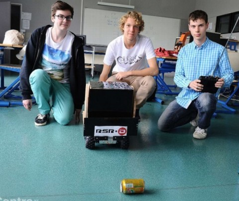
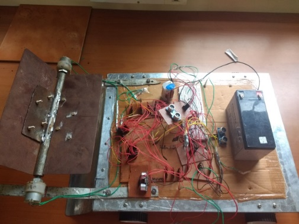
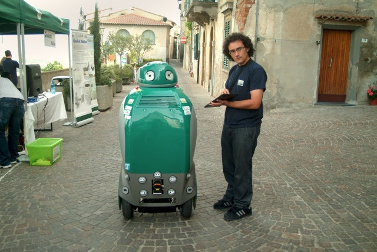

=== Description de l’état de l’art
ifdef::env-gitlab,env-browser[:outfilesuffix: .adoc]

==== Robots grand public

Les robots aspirateurs sont sans doute les robots nettoyeurs les plus populaires. Depuis les débuts de leur commercialisation il y a une vingtaine d'année, il s'en est vendu des dizaines de millions.

Il s'agit en général de cylindres roulant capables de s'orienter dans une pièce, voire dans un étage entier, et aspirant les saletés. Ils se basent sur des heuristiques ou sur de l'analyse d'images pour les plus développés.

Le robot de notre projet n'a pas pour objectif de nettoyer le sol mais de ramasser des déchets et d'habituer des enfants à le faire par leur propre initiative.

==== Robot ramasseur de déchet

Nous n'avons pas trouvé de robots ramasseurs de déchets en vente au grand public, mais plusieurs projets de ce genre ont déjà été réalisés, par exemple <<OLYMPSC>> par des lycéens et <<AUTGCR>> par des étudiants ingénieurs indiens.

Le premier a pour principale différence le contrôle du robot : le leur est télécommandé alors que le notre devra être 'intelligent' pour s'orienter tout seul, reconnaître des déchets, les ramasser et les amener à une poubelle.

Le second projet est plus proche du notre en terme de conception. Cependant il doit être préprogrammé (il suit un chemin prédéfini) et utilise des capteurs de proximité pour détecter les déchets.

De plus, des projets plus professionnels existent, par exemple <<DUSTBOT>> financé par la commission européenne.

