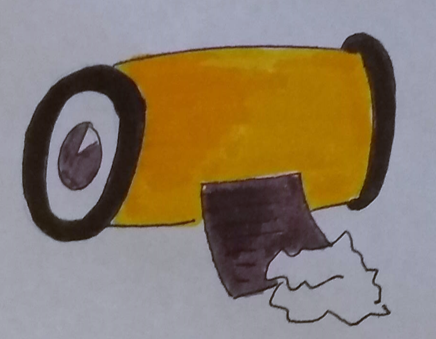
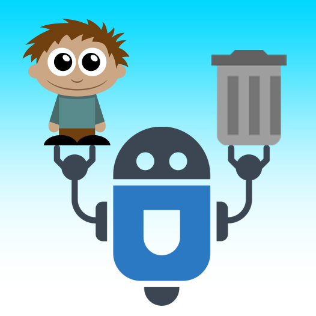

=== Description de la proposition
*_Note: 2 page max._*

_Décrire de façon détaillée votre projet : motivations de base/problèmes
constatés avant élaboration du projet, comment votre projet répond à ces
besoins. Ajouter une image ou une figure pour montrer à quoi cela
ressemble si besoin._

Suite à une récente prise de conscience de la population sur la lutte
contre les déchets, notre projet PACT s’inscrit dans la continuité du
combat du mouvement CleanWalker : sensibiliser la population sur la
question de la pollution due à l’abandon des déchets sur le sol. Il
se propose donc par une approche pédagogique et ludique de toucher
les générations les plus jeunes dans le but d’augmenter l’impact de
cette question sur notre société.

L’objectif est donc de rendre un geste, qui au départ peut dégoûter
ou ennuyer l’enfant, parfaitement naturel grâce à des ateliers dédiés.
L’idée est de faire passer le message suivant: “Même si ce déchet
n’est pas le vôtre, même si ce n’est pas vous qui l’avez laissé là,
il se trouve qu’à l’instant où vous passez à côté il s’agit du vôtre”.
Ainsi, à l’aide d'un petit robot capable de reconnaître les déchets (non dangereux)
sur le sol, de les amener près d’une poubelle et de capter l’attention
des enfants par un jeu de sons et de lumières afin qu’ils soient amenés à ramasser et
jettent le ou les déchets dans la poubelle, notre robot permettrai de remplir
cet objectif. Il sensibilise l'enfant tout en l'amusant, et le pousse à réaliser un geste qu’il
n’aurait peut-être pas fait naturellement. De plus, la participation
des enfants est assurée grâce à un système de bons points distribués
lorsque la bonne action est réalisée.

Finalement, dans l’optique de contribuer au développement durable,
notre projet joue sur deux tableaux : d’une part notre robot est
écologique, il réduit le nombre de déchets laissés sur le sol, et d’autre
part il a pour vocation d’éduquer les enfants sur un enjeu de société.
Ainsi notre projet PACT contribue à deux piliers majeurs du développement durable.

=== Exemples d'utilisation d'AsciiDoc

_Ici quelques exemples de syntaxe AsciiDoc pour ajouter des équations, des images, des listes..._

_Ces exemples *ne doivent pas* être conservé dans la version finale du rapport._

==== Exemples d'équations

* Inline math: latexmath:[\int_{-\infty}^\infty g(x) dx]
Pour ajouter une équation ou un symbole mathématique dans le corps du texte.

* Block math pour avoir une équation centrée au milieu de la page:

[latexmath]
++++
\int_{-\infty}^\infty g(x) dx
++++

==== Exemples d'images

* Ceci est un exemple d'image:

* L'image peut être redimensionnée et avoir un titre:

.Le logo du projet
image::../images/logo_PACT.png[logo pact, 400, 400]

* Pour le rapport, les images peuvent être aux formats jpeg, png ou même *svg*:

image::../images/pact.svg[un autre logo pact,300,300]

* Les images peuvent aussi être mises dans le corps du texte par exemple image:../images/logo_PACT.png[logo pact, 50,50].

==== Exemples de code

On peut ajouter des blocs de code formatés en précisant le langage utilisé:

[source,python]
----
def func(i):
   x = 3 + i
   return x

for i in range(10):
   print "---> ", func(i)
----

[source,java]
----
class foo {
   Integer i;
   String s;
}
----

==== Exemples de listes

* AAAA
** aaaaa
*** axaxax
** bbbbb
** ccccc
* BBBB
* CCCC

'''''

.  AAAA
..  aaaa
..  bbbb
.  BBBB
.  CCCC

'''''

.Liste des tâches à faire:
*  [ ] Pas encore fait
** [ ] étape X
** [x] étape Y (a démarré en avance)
** [ ] étape Z
*  [x] Complètement finit
** [x] étape Q
** [x] étape R
** [x] étape `finale` E=mc^2^

'''''

.Liste descriptive:

Étape 1::: Faire A, B, C…
Étape 2::: Faire X, Y, Z…
Étape 3::: Faire W, et c'est fini…

